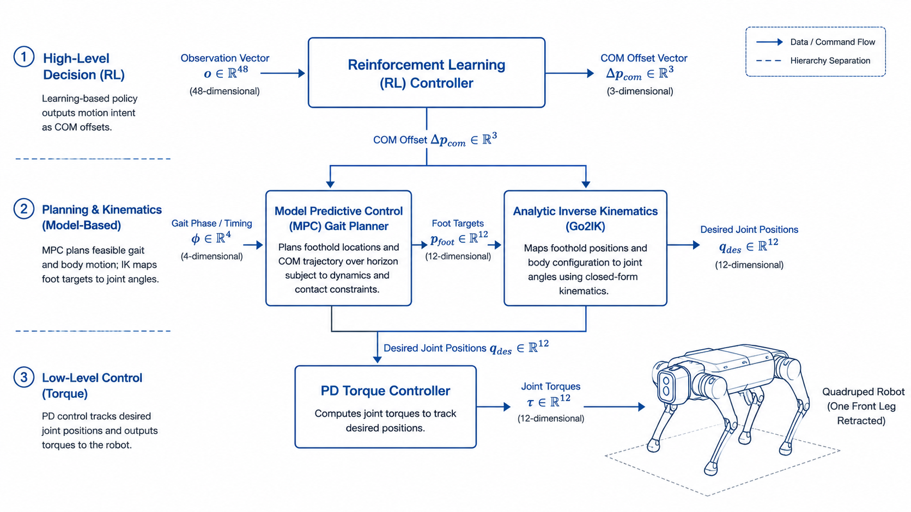
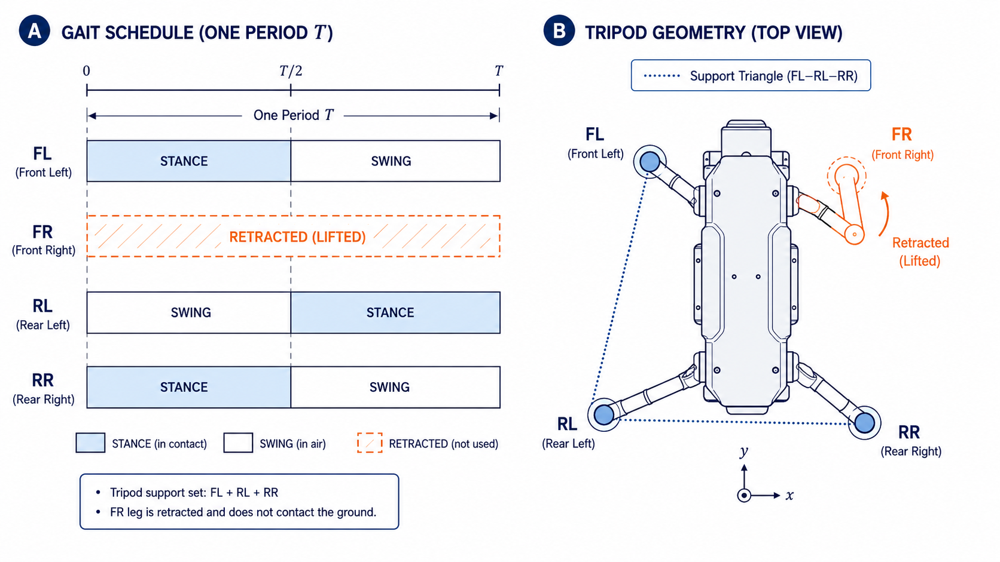
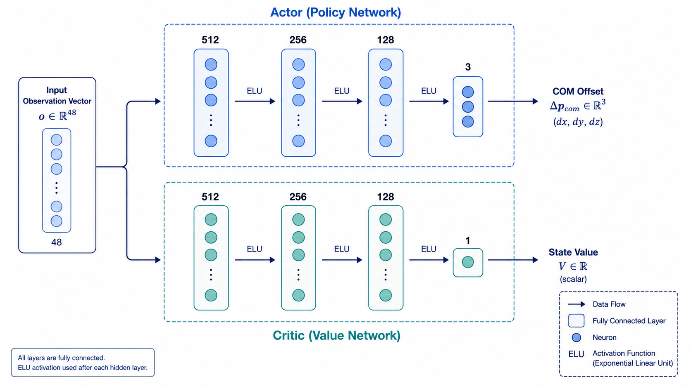

# RL+MPC Locomotion — Three-Legged Walking on Unitree Go2

<p align="center">
  <video src="images/real-3legged.mp4" controls muted autoplay loop width="85%"></video>
</p>

<p align="center">
  <b>A hierarchical RL+MPC control framework for three-legged (tripod) walking on the Unitree Go2 robot.</b><br>
  <em>RL predicts center-of-mass offset — MPC generates stable gait kinematics — deployed to real hardware.</em>
</p>

<p align="center">
  
  
  
  
</p>

<p align="center">
  <em>Based on <a href="https://github.com/silvery107/rl-mpc-locomotion">rl-mpc-locomotion</a> by Yulun Zhuang, Wei Zhang.</em>
</p>

---

## Overview

<p align="center">
  
</p>

This project extends the original RL+MPC locomotion framework to achieve **three-legged (tripod) walking on a real Unitree Go2**, with the front-right leg permanently retracted. The system decomposes the control problem into two levels:

| Level | Role | Output |
|-------|------|--------|
| **RL** (High-level) | Learned policy via PPO | 3-dim COM offset `[dx, dy, dz]` |
| **MPC** (Low-level) | Model-based gait controller | 12-dim joint positions via analytic IK |

This hierarchy reduces the RL action space from 12-dim (direct joint control) to just 3-dim, dramatically lowering learning difficulty while keeping the gait physically stable.

---

## Tripod Gait Design

<p align="center">
  
</p>

The front-right (FR) leg is **permanently retracted**. The remaining three legs — FR-Left, Rear-Left, Rear-Right — cycle through swing and stance phases with staggered offsets, ensuring at least two legs are always in contact with the ground for stability.

---

## Neural Network

<p align="center">
  
</p>

An **Actor-Critic** architecture trained with PPO:

- **Input**: 48-dim observation vector (body state, joint positions, velocity commands, history)
- **Actor**: `48 → 512 → 256 → 128 → 3` (ELU activations, ~189k parameters)
- **Critic**: `48 → 512 → 256 → 128 → 1`
- **Output**: 3-dim COM offset decoded to `[0.023~0.27, 0.063~0.067, -0.01~0.01]` meters

> Full network details, reward function formulation, and PPO update process are documented in **[theory.md](theory.md)**.

---

## What's New in This Fork

| Feature | Description |
|---------|-------------|
| **Three-Legged (Tripod) Walking** | FR leg retracted, walking on FL+RL+RR legs. RL controls COM offset for balance; MPC provides stable gait kinematics |
| **CPU-Only Training** | Full training pipeline runs on CPU (64 parallel Isaac Gym environments, `CUDA_VISIBLE_DEVICES=""`) |
| **Go2 Real-Robot Deployment** | Complete deployment pipeline via Unitree SDK with state machine (DAMP → QUAD_WALK → TRIPOD_STAND → WALK) |
| **Analytic IK Solver** | Custom `Go2IK` — geometric inverse kinematics for Go2, no external dependencies |
| **Reduced Action Space** | RL outputs 3-dim COM offset instead of 12-dim joint positions, drastically simplifying learning |

---

## Installation

```bash
# 1. Clone with submodules
git clone --recurse-submodules git@github.com:YOUR_USERNAME/YOUR_REPO.git
cd rl-mpc-locomotion

# 2. Install conda environment
conda env create -f environment.yml

# 3. Install rsl_rl
cd extern/rsl_rl && pip install -e . && cd ../..

# 4. Compile MPC solver bindings
pip install -e .
```

**Dependencies**: Python 3.8+, [PyTorch 1.10+](https://pytorch.org/), [Isaac Gym Preview 4](https://developer.nvidia.com/isaac-gym)

---

## Quick Start

### Training (CPU)

```bash
cd RL_Environment
CUDA_VISIBLE_DEVICES="" python train_go2_rl_mpc_simple.py task=Go2RLMPCSimple headless=True
```

Monitor with TensorBoard: `tensorboard --logdir runs` — checkpoints saved every 100 iterations.

### Real-Robot Deployment

```bash
# Pure MPC mode (no RL)
python deploy_walk1.py

# RL+MPC mode (use trained model)
python deploy_walk1.py --rl --checkpoint=runs/Go2RLMPCSimple/May15_18-14-35/model_2000.pt

# Manual keyboard control
python deploy_walk1.py --manual
```

### Original MPC Controller (Aliengo/Go1/A1)

```bash
python RL_MPC_Locomotion.py --robot=Aliengo
```

---

## Project Structure

```
rl-mpc-locomotion/
├── RL_Environment/        # Isaac Gym training environments + PPO configs
│   ├── train_go2_rl_mpc_simple.py   # Training entry point
│   ├── tasks/go2_rl_mpc_simple.py   # Env: observation, reward, MPC invocation
│   └── cfg/                         # YAML hyperparameter configs
├── Go2_Controller/        # MPC gait controller + analytic IK solver
│   └── mpc_walk1.py                 # Go2IK, MPCController, BalanceController
├── deploy_walk1.py        # Real-robot deployment with state machine
├── extern/rsl_rl/         # PPO implementation (Actor-Critic, RolloutStorage)
├── images/                # Diagrams, figures, and demo video
├── theory.md              # Full technical documentation
└── README.md              # ← You are here
```

---

## Further Reading

For the complete theoretical background — including reward function derivation, PPO update equations, observation space breakdown, MPC controller details, hyperparameter analysis, and deployment architecture — see:

<p align="center">
  <b>📖 <a href="theory.md">theory.md</a></b>
</p>

---

## Citation

If you use this work, please cite both the original and this extension:

```bibtex
@software{Zhuang2022rlmpc,
  author = {Yulun Zhuang and Wei Zhang},
  title = {rl-mpc-locomotion},
  year = {2022},
  url = {https://github.com/silvery107/rl-mpc-locomotion}
}
```

## License

MIT License. Copyright (c) 2021 Yulun Zhuang. See [LICENSE](LICENSE) for details.
